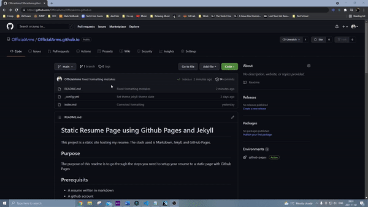

# Static Resume Page using Github Pages and Jekyll

This project is a static site hosting my resume. The stack used is Markdown, Jekyll, and GitHub Pages.

## Purpose

The purpose of this readme is to teach you the steps you need to setup your resume to a static page with Github Pages, and learn how easy it is to maintain. 

A big inspiration for this project comes from Andrew Etter's book - Modern Technical Writing: An Introduction to Software Documentation, which can be found in the **More Resources** Section. Etter describes the importance of static webpages over traditional dynamic pages or uploading files as PDFs. It's far easier to create and update a simple static web page to host your lightweight documentation than it is to try and update a dynamic page, or a pdf file people have already downloaded. 

I hope that this tutorial will show how easy it is to setup, update, and maintain a static webpage and get you interested in the value it brings. 

## Prerequisits

* A resume written in markdown
* A github account 
* Very basic experience with a git environment

If you do not have any experience in Markdown a great tutorial can be found in the **More Resources** section

## Instructions

### Creating your repository

1. Go to Github.com
2. Click the create new repository icon on the left side of the page
3. Create your new repository
    1. Name the repository ***username*.github.io**, where *username* is replaced with you're Github account's username
    2. Set the repostory to public
    3. Check the box to include a readme
    4. Click the green **create repository button**

### Choose your template

1. Go to the settings of your repository
2. Click the _Pages_ tab
3. Click _Change Theme_
4. Select the theme you enjoy the most
5. Commit the changes to your repository, available at the bottom of the page

An updated readme should now be at the main page of your repository, along with a new \_config.yml file. This config file is where the template is stored and you can update which template is used manually if you know the name of a different template.

Once this template has been added going to the URL: **_username_/github.io** should lead you to a static page with the previously generated readme now using your chosen template. 

The great thing about these templates is at anypoint if you want to change them it's as simple as going back into that template viewer and selecting a new one. 

### Adding your resume

Once you've set initialized your repository and set a template you like the remaining steps involved are to upload your resume to your repoistory.

1. Clone your repository to your local machine
2. Add your Markdown resume to the repository nameed _index.md_ and push it to update those changes to Github
3. Visit **_username_/github.io** again and your resume should be viewable on your Github Pages domain with the template you chose

You're now done. Viewing your resume online should now be as simple as putting in your repositories name as your URL 🎉

If you still see the _Welcome to GitHub Pages_ readme text first ensure your changes have been pushed to Github. First check to see if your resume file _index.md_ is in your repository on Github. If it is give the page a view seconds to update the page and refresh the page when 5-10 seconds have passed.  

# Authors and Acknowledgements 

Theme Used in Resume: Github Pages, Slate theme

Critiquing and Assistance From:

* Anton Sikorsky 
* Ikram Khan Shipon 
* Ryan Campbell 
* Kevin Kim 

## FAQs

**Q: Why is Markdown better than a word processor?**

A: Markdown is a lightweight solution to documentation. It allows the documentation to be writen simply, then automatically processed through static site generators. This allows templates to much more easiy be used updated to fit the needs of the documentation

**Q: Why is my resume not showing up**

A: The issue may stem from several different sources. I'd recommend trying the following steps in order:

1. Refresh the page - There may not have been enough time for Github to update the changes after a push
2. Verify that the resume is a file listed your Github repository
3. Ensure that the repository and URL to the page used are in the format _**username**.github.io_  

## More Resources

**[Linuxhint's Markdown Tutorial](https://linuxhint.com/markdown-tutorial-from-setup-to-syntax/)**

**[Andrew Etter's book - Modern Technical Writing: An Introduction to Software Documentation](https://www.amazon.ca/Modern-Technical-Writing-Introduction-Documentation-ebook/dp/B01A2QL9SS)**

**[Github Pages' Help Page](https://docs.github.com/en/pages)**
